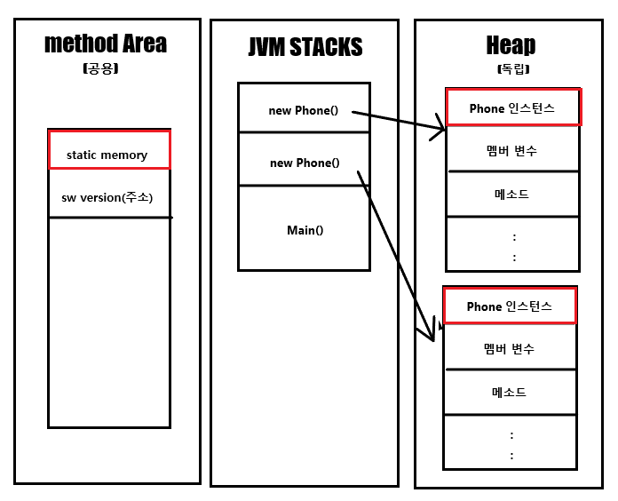

 # OOP 란?
한글로 객체지향 프로그래밍. 
**데이터와 이를 처리하는 루틴을 하나의 독립된 객체로 동작하는 것을 지향하는 것을 말합니다.**

**절차지향 프로그래밍 언어의 대표격인 C와 뭐가 다른가?**  

기존 절차지향 프로그래밍은 C는 각 명령어의 작성을 실행 순서대로 합니다. 즉 ,위에서 아래로 일련의 실행 코드들이 작성되어 진다는 것입니다.  
하지만 OOP 언어를 사용한다면 아래와 같은 특징을 가지는 방식으로의 프로그래밍이 가능합니다.
<br/><br/>

### 1. OOP의 특징
- 추상화  
현실 세계에 존재하는 객체의 주요특징을 추출하는 것
- 캡슐화  
하나의 클래스 안에 데이터와 기능을 담아 정의하고, 중요한 데이터나 복잡한 기능등은 숨기고, 외부에서 사용에 필요한 기능만을 공개하는 것.
- 상속성  
객체를 정의할때 기존 존재하는 객체의 속성과 기능을 상속받아 더 발전된 형태로 정의하는것
- 다형성  
같은 타입 또는 같은 기능의 호출로 다양한 효과를 가져오는것. 예를 들면 오버라이딩,오버로딩 등이 있다.


Java는 Object Oriented Programming 을 지향하고 있습니다.
조금 더 좋은, 그리고 안전한 코드를 작성하기 위해서 이 OOP에 대한 이해가 충분하게 필요하고 이에 부합하는 다양한 코드 작성 패턴을 학습 해야한다고 생각합니다.
  


### 2. Class ? Object ?
Object - 시스템의 대상이 되는 모든 것.  
예를 들면 쇼핑몰 시스템에서, 상품/고객/주문 등등을 Object로 표현하게 됩니다.   
Object는 **구체적**인 표현 대상이 있습니다. 상품 Object는 쇼핑몰에서 판매하는 A상품,B상품 등을 표현 할 수있습니다.  
Class는 이런 Object를 분석해서 공통적인 내용들을 추상화 해서 Programming 언어로 표현한 것입니다. 


> OOP와 절차지향 프로그래밍의 근본적 차이점은, OOP는 현실세계의 Object를 분석해서 특정한 기준에 따라 Classification 하여 Class로 정의하고 이 Class 를 통해서 객체를 만들어내어 일련의 알고리즘을 진행하는 것이라 생각합니다.


### 3. Class는 어떻게 만들어야 할까요?
Class를 만들기 전에, Class만의 정적인 특성과 동적인 특성을 파악해야합니다.  
정적인 특성은 attribute, 동적인 특성을 behavior 라고 합니다.  
이러한 특성은 Class가 어떤 시스템에서 사용되느냐에 따라서 다르게 정의 될 수 있습니다.

만약 휴대폰 쇼핑몰에서 Galaxy Note라는 클래스를 만든다고 하면, [이름과 색상, 가격]은 정적 특성인 attribute가 될것이고 동적 특성에는 [개인에 맞게 할부원금을 계산하는 행위] 등 있겠습니다.

다른 예로, 만약 삼성에서 제조관리 시스템을 제작하기위해 똑같이 Galaxy Note라는 클래스를 만든다면 [시리얼넘버,재질,조립상태]등이 정적 특성으로 분류되어 질것이고, 동적 특성에는 [불량을 확인하는 행위]가 있겠습니다.

즉, 시스템의 의도나 목적에 따라 같은 현실객체를 정의한 클래스라도 다른형태로 나타날 수 있습니다.
그러니 이런 현실세계의 Object를 Class로 도출하는 과정이 아주 중요 하다고 볼 수 있겠습니다.


### 4. 아스날


### 5. 클래스 한눈에 알아보기
```java
public class Phone {
    public String name;
    public char color;
    public int price;
    public static double SWversion;

    public int getRealDebt(){ 
        return 10000;
    }
    public phone(){
        this.name="galaxy";
        this.color="black";
        this.price="1000";
        this.SWversion="1.0";
    }
}
```
휴대폰이라는 클래스는 이름, 색깔, 가격 그리고 SW 버전이라는 attribute를 가지고 있습니다. 그리고 getRealDebt라는 메소드도 가지고 있죠.  
**이중 static이 함께 선언된 SWversion** 은 무슨 의미일까요? 이를 알기위해서는 메모리 저장 영역에 대한 이야기가 필요합니다.

## - 메모리에는 어떻게 저장될까?


나는 이렇게 저장될것이라고 이해했다.
그렇다. Static으로 선언된 인스턴스는, method area라는 공용 메모리 공간에 저장되고, 다른 곳에서도 이 인스턴스에 접근이 가능하다.
>***인스턴스는 어떤 원본(추상적인 개념)으로부터 ‘생성된 복제본’을 의미합니다.***

이를 활용한것이 싱글턴 패턴이라고 생각했다면 이미 당신은 실력자.

클래스를 메모리에 올리기위해 new를 한다면 이 클래스는 소프트웨어적으로 인스턴스화 되었다고 볼 수 있고, new를 할때마다 힙에 각각의 메모리 공간을 할당받는다. 
**메모리 구조가 이렇게 되어있기 때문에 같은 클래스에서 생성된 인스턴스라도 값이 다를수 있다는 말이다.**
