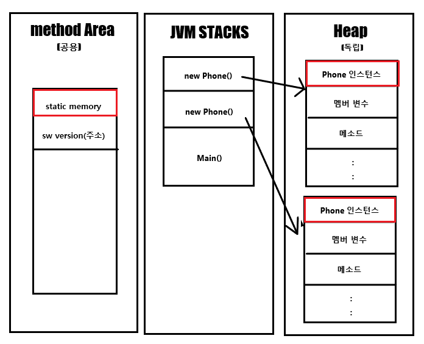

 # OOP 란?
 
한글로 객체지향 프로그래밍. 
**데이터와 이를 처리하는 루틴을 하나의 독립된 객체로 동작하는 것을 지향하는 것을 말합니다.**

**절차지향 프로그래밍 언어의 대표격인 C와 뭐가 다른가?**  

기존 절차지향 프로그래밍은 C는 각 명령어의 작성을 실행 순서대로 합니다. 즉 ,위에서 아래로 일련의 실행 코드들이 작성되어 진다는 것입니다.  
하지만 OOP 언어를 사용한다면 아래와 같은 특징을 가지는 방식으로의 프로그래밍이 가능합니다.
<br/><br/>

### 1. OOP의 특징
- 추상화  
현실 세계에 존재하는 객체의 주요특징을 추출하는 것
- 캡슐화  
하나의 클래스 안에 데이터와 기능을 담아 정의하고, 중요한 데이터나 복잡한 기능등은 숨기고, 외부에서 사용에 필요한 기능만을 공개하는 것.
- 상속성  
객체를 정의할때 기존 존재하는 객체의 속성과 기능을 상속받아 더 발전된 형태로 정의하는것
- 다형성  
같은 타입 또는 같은 기능의 호출로 다양한 효과를 가져오는것. 예를 들면 오버라이딩,오버로딩 등이 있다.


Java는 Object Oriented Programming 을 지향하고 있습니다.
조금 더 좋은, 그리고 안전한 코드를 작성하기 위해서 이 OOP에 대한 이해가 충분하게 필요하고 이에 부합하는 다양한 코드 작성 패턴을 학습 해야한다고 생각합니다.
  


### 2. Class ? Object ?
Object - 시스템의 대상이 되는 모든 것.  
예를 들면 쇼핑몰 시스템에서, 상품/고객/주문 등등을 Object로 표현하게 됩니다.   
Object는 **구체적**인 표현 대상이 있습니다. 상품 Object는 쇼핑몰에서 판매하는 A상품,B상품 등을 표현 할 수있습니다.  
Class는 이런 Object를 분석해서 공통적인 내용들을 추상화 해서 Programming 언어로 표현한 것입니다. 


> OOP와 절차지향 프로그래밍의 근본적 차이점은, OOP는 현실세계의 Object를 분석해서 특정한 기준에 따라 Classification 하여 Class로 정의하고 이 Class 를 통해서 객체를 만들어내어 일련의 알고리즘을 진행하는 것이라 생각합니다.


### 3. Class는 어떻게 만들어야 할까요?
Class를 만들기 전에, Class만의 정적인 특성과 동적인 특성을 파악해야합니다.  
정적인 특성은 attribute, 동적인 특성을 behavior 라고 합니다.  
이러한 특성은 Class가 어떤 시스템에서 사용되느냐에 따라서 다르게 정의 될 수 있습니다.

만약 휴대폰 쇼핑몰에서 Galaxy Note라는 클래스를 만든다고 하면, [이름과 색상, 가격]은 정적 특성인 attribute가 될것이고 동적 특성에는 [개인에 맞게 할부원금을 계산하는 행위] 등 있겠습니다.

다른 예로, 만약 삼성에서 제조관리 시스템을 제작하기위해 똑같이 Galaxy Note라는 클래스를 만든다면 [시리얼넘버,재질,조립상태]등이 정적 특성으로 분류되어 질것이고, 동적 특성에는 [불량을 확인하는 행위]가 있겠습니다.

즉, 시스템의 의도나 목적에 따라 같은 현실객체를 정의한 클래스라도 다른형태로 나타날 수 있습니다.
그러니 이런 현실세계의 Object를 Class로 도출하는 과정이 아주 중요 하다고 볼 수 있겠습니다.


### 4. 아스날


### 5. 클래스 한눈에 알아보기
```java
public class Phone {
    public String name;
    public char color;
    public int price;
    public static double SWversion;

    public int getRealDebt(){ 
        return 10000;
    }
    public phone(){
        this.name="galaxy";
        this.color="black";
        this.price="1000";
        this.SWversion="1.0";
    }
}
```
휴대폰이라는 클래스는 이름, 색깔, 가격 그리고 SW 버전이라는 attribute를 가지고 있습니다. 그리고 getRealDebt라는 메소드도 가지고 있죠.  
**이중 static이 함께 선언된 SWversion** 은 무슨 의미일까요? 이를 알기위해서는 메모리 저장 영역에 대한 이야기가 필요합니다.

## - 메모리에는 어떻게 저장될까?


> 함수코드는 Method Area에, Stack에는 런타임에 호출되어지는 메소드가, 실제로 선언과 호출에 의해 발생하는 메모리 할당은 heap에 객체 별로 독립적으로.

나는 이렇게 저장될것이라고 이해했다.
그렇다. Static으로 선언된 인스턴스는, method area라는 공용 메모리 공간에 저장되고, 다른 곳에서도 이 인스턴스에 접근이 가능하다.
>***인스턴스는 어떤 원본(추상적인 개념)으로부터 ‘생성된 복제본’을 의미합니다.***

클래스를 메모리에 올리기위해 new를 한다면 이 클래스는 소프트웨어적으로 인스턴스화 되었다고 볼 수 있고, new를 할때마다 힙에 각각의 메모리 공간을 할당받는다. 
**메모리 구조가 이렇게 되어있기 때문에 같은 클래스에서 생성된 인스턴스라도 값이 다를수 있다는 말이다.**


### 6. 배열을 array List처럼 자연스럽게 늘리는방법
java에서 배열은 메모리의 순서로 지정된 공간을 칭하고 index를 통해 메모리에 접근한다고 알려져있다. 하지만 이런 순차자료구조는 배열의 변경이나 삭제등에서 나타나는 오버헤드나 여타 다른 성능적인 불리함을 가지고있다 더 많은 기능을 가진 클래스로 List 클래스가 존재한다. (ArrayList,LinkedList 등)

ArrayList에서는  data 가 append 되었을때 메모리를 늘려주게 되는데.
이것은 Arrays.copyOf() 메소드가 이용된다. 이것을 구현 해보자.

ArrayList clone coding
1. 값을 넣을 공간이 있는지 확인한다.
2. 공간을 추가한 새로운 배열을 생성한다.
3. 기존 배열의 내용을 새롭게 생성한 배열로 복사한다.
4. 기존 배열을 가르키는 변수에 새로운 배열의 주소값을 입력한다.

```java
/*Movie 클래스*/
public class Movie {
    private String title;
	private String director;
	private int grade;
}
```

```java
/*영화를 담는 DAO 클래스인 MovieMgr*/
public class MovieMgr {
	private static MovieMgr INSTANCE;	
	private MovieMgr(){		
	}
	public static MovieMgr getInstance() {
		if(INSTANCE == null) {
			INSTANCE=new MovieMgr();
		}
		return INSTANCE;
	}
	private Movie[] movies = new Movie[100];
	// 데이터가 들어갈 위치와 입력된 데이터의 크기
	
	private int index;//
	/** 파라메터로 전달된 화 정보를 전달받아 배열에 저장한다. */
	public void add(Movie m) {		
		movies[index]=m;
		index++;
		
	}
}
```

MovieMgr 클래스는 movie 클래스를 저장할수있는 클래스이다.
내부적으로 배열을 가지고있고 add메서드를 실행할때 movies 배열에 movie 인스턴스를
저장 할 수 있다. 


```java
public void add(Movie m) {
		movies[index]=m;
		index++;	
	}
```
이렇게 만들어버린다면, index가 선언된 movies 배열의 크기이상으로 넘어갈때 error를 발생시킬것이다. 여기서 Arrays.copyOf() 메서드와 같이 구현을 한다면.

```java
public void add(Movie m) {	
		//1 .체크
		if (index == movies.length) {
			// 2. 기존 배열의 2배로 새로운 배열 생성(임의의 값으로 더 큰새로운 배열을 생성해도 된다.)
			Movie[] temp = new Movie[index*2]; //새로운 배열
			// 3. 기존 배열의 내용을 새로 만들어질 더 큰 공간의 빈 배열로 복사한다.
			for(int i=0; i<index*2 ;i++) {
				temp[i]= movies[i]; 
			}
			// 4.새롭게 생성된 배열의 주소값을 기본 변수에 대입한다.
			movies=temp;
		}
		movies[index]=m;
		index++;
	}
```


```java
public void add(Movie m) {	
		//1 .체크
		if (index == movies.length) {
			Arrays.copyOf(movies,index *2 );
		}
		movies[index]=m;
		index++;
	}
```

두개의 코드는 같은 결과를 얻을 수 있다.

이 테스트는 우리가 자연스럽게 쓰고있던 것들도 누군가 구현한 것 이라는것을 더 실감하게 되는 테스트인것 같다.. 앞으로 api라고 맨날 모르고 쓰지말고 어떻게 만들어졌는지도 확인해보면서 써야겠습니다.


### 7. 상속 
자바는 class 상속(extends) 를 통해 부모-자식 클래스 관계를 표현하며, 확장성을 제공한다고 볼 수 있습니다.

Java는 단일상속만 가능합니다. 즉
```java
class test extends super1,super2{
	
}
```
와 같은 코드를 실행시킨다면 에러가 발생하게됩니다.

> 다중 상속이 안되면 어떻게 여러가지 공통점들을 분리해낼 수 있나요?  

그것을 위해 java에서는 interface를 제공하고있습니다. 나중에 설명하도록 하겠습니다.

extneds와 implements의 차이는 의도의 차이라고 생각합니다. 

extends는 부모의 메소드를 그대로 사용하던가, 아니면 자신만의 메소드로 더 확장시켜서 어떤 확장의 의도를 가진 개념이고.  

implements는 메소드의 행위 자체를 인터페이스에서 구현하지않고 implements받은 클래스에서 구현되는것을 강조하여, 어떤 행위의 다양성을 부여하는 의도를 가지고 있다고 생각합니다.

#### Object 클래스
자바에서는 트리구조로 클래스들을 관리하는데 object 클래스는 모든 클래스의 root 가 되는 근본이 있는 클래스입니다.  
유저가 어떤 클래스를 생성할때에 직접 명시하지 않아도 컴파일러단에서 알아서 object class를 상속하게 됩니다.
우리는 그래서 toString을 오버라이딩 해서 사용할 수 있는 편안함을 느끼고있는 것이죠(출력시에 자동 형변환도 되고!). 

> 배열도 Object에 저장되어지지만 좀 특별한 경우가 있다.

```java
Object o = 123;
```
위와 같은 경우에는 어떻게 표시되어질까?   
123이라는 값은 상수 리터럴 이니까 객체가 아니라서 Object에 삽입하지 못할 것 같지만 , java 1.5버전부터 컴파일러단에서 다음과 같은 형태로 자동 변환해주어 가능해졌다고 한다
```java
Object o = Integer(123);
```

#### 한가지 더 특별한 케이스
```java
class A{
	a(){

	}
	info(){

	}
}
class B extends A{
	@Override
	info(){

	}
}
public static void main(String[] args){
	A a=new B b();
	a.a()
	a.info();
}
```
위와같이 선언했을때, 묵시적 형변환으로 부모클래스인 a의 메소드를 사용하게 되지만 만약 자식에서 오버라이드가 되어있다면? 오버라이드된 메소드를 사용한다!

### 8.인터페이스
추상화의 꽃! 인터페이스입니다.
인터페이스는 **mathods의 추상화**한것이고 class와 독립적인 개념으로 interface라고 이름을 지었다고 합니다.

인터페이스는 관련된 methods 들을 "선언"만 할 수 있습니다. 구현의 책임은 interface를 implements 하는 클래스에게 전적으로 위임한 것입니다.

상속은 재사용에 초점이 맞추어져있고, 인터페이스는 어떤 규정이나 약속 이라는 느낌으로 생각하면 맞겠습니다.

예시를 들어보면.
즉 phone이라는 부모클래스의 자식클래스로 두개의 클래스를 만들었다고 생각해봅시다.
  
FolderblePhone과 nomalphone 두개 가장 큰 차이는 접히느냐?안접히느냐? 라는 차이가있습니다. 하지만 폰이라는 점은 같죠.

그렇게 했을때 가장 이상적인 상속관계는  

분류|클래스 명
---|---
| 부모 | Phone  |
| 자식 | folderblePhone,nomalPhone |  


다음과 같아지겠습니다. 
여기서 부모 클래스에 phone에 접히는 기능을 추가해버린다면? nomalPhone도 접히는 메소드를 받아버리고, 이에 아무행동을 하지않는것으로 재정의를 해야되겠죠?

그래서 interface를 통해 접고,펼치는 행위를 만들어주어서 folderblePhone 클래스에 implements 를 해주어야 합니다.


#### 시나리오
A와 B는 I라는 같은행위를 가지고 있고, 이를 인터페이스로 정의하였습니다. 

A는 B의 전부를 원하는게아니라, 필요한 어떤 method의 수행을 원하고있습니다. 하지만 A는 그 사용하고싶은 method가 내부적으로 어떻게 구현 되어 있는지도 관심 없고 관심을 가져서도 안됩니다.  

B역시 A가 필요로 하는 모든것에 대해 자신의 method 의 모든것을 노출하고 싶지않고, 호출 방법과 결과에 대한 기본적인 사항만 공유되기를 바랍니다. 

이때 인터페이스를 사용하면 B는 자신의 code를 공개하지않고 A에게 메소드를 제공할 수 있습니다.

##### 인터페이스 끼리도 상속이 가능합니다! 

```java
interface Inter01 {
}

interface Inter02 {
}

interface Inter03 extends Inter02 {
}

interface Inter04 extends Inter01, Inter02 {
}

class Parent01 {
}

class Parent02 {
}

class InterChild extends Parent01 implements Inter01, Inter02 {
}

public class Test01 {
	public static void main(String[] args) {

	}
}

```

인터페이스에 선언되는 모든 변수는 상수로인식합니다.
즉, public static final 키워드가 자동 추가됩니다

인터페이스에 선언되는 메서드는 추상 메서드로 인식합니다.
public abstract 키워드가 자동 추가 됩니다.

```java
interface ServerInfo {
	/*public static final*/ String IP="192.168.0.110"; 
}
```
즉 이런형태로 선언 되어 진다는 것입니다.
자바에서 final 키워드가 붙으면? 상수가 되어 버립니다.

아래에서 테스트 해보겠습니다

```java
interface ServerInfo {
	/*public static final*/ String IP="192.168.0.110"; 
	/*public abstract*/ void call();
}
public class Test02 {
	public static void main(String[] args) {
		System.out.println(ServerInfo.IP); // static 성질 확인
		ServerInfo.IP="1223";
	}
}
```

```
The final field ServerInfo.IP cannot be assigned
```
static 성질과 final 상수가 된것을 알수있고, 인터페이스에 선언된 void call() 메서드도 구현부가 없는데 에러가 나지않는 이유는, abstract 키워드를 묵시적으로 붙혀주기 때문이다.

이렇게 되기 때문에, 만약 Interface를 구현하는 클래스에서 새로 메서드를 오버라이딩 할때 public을 붙혀주어야 합니다. (컴파일러단에서 interface에 선언된 메소드에 자동으로 public static 키워드가 붙어서 해석해주기 때문에)

#### java8 버전부터 생긴 default와 static
```java
interface AIMachine {
	void work();
	void tell();
}
class KakaoAIMachine implements AIMachine{
	@Override
	public void work(){		
	}
	@Override
	public void tell() {
	}
}

class NaverAIMachine implements AIMachine{
	@Override
	public void work(){	
	}
	@Override
	public void tell() {	
	}
	
}
```
#### 시나리오
카카오와 네이버가 걷고,대화할수있는 AI로봇을 만들었는데 카카오는 음악을 실행하는 music()이라는 행동을 추가하려고한다. 근데 네이버는 아직 음악을 실행하는 기능을 만들지 않았다.

국내 기업들의 AIMachine 을 총괄하는 사람은 고민에 빠지게 되었다

1. music()메서드의 추가를 위해 KakaoAIMachine 클래스에 별도의 메서드를 정의하다보면 AIMachine의 수가 아주많이 늘어났을때 관리가 불가능해 질 것이다.

2. 그렇다고 인터페이스에서 선언해서 사용하자니 해당기능을 가지고있지 않은 클래스도 이를 구현해야하는 상황이다.

기존에는 interface를 하나 더 추가해서 다중 implements 를 했겠지만 자바 8 버전 부터 추가된 default 기능과 static 기능으로 이런 부분들에대한 불편이 해소되었습니다.


```java
interface AIMachine {
	void work();
	void tell();
	default void music() {
		System.out.println("아직 지원되지않는 기능입니다");
	}
	static void common() {
		System.out.println("공통으로 사용되는 기능 정의");
	}
}
class KakaoAIMachine implements AIMachine{
	@Override
	public void work(){
		
	}
	@Override
	public void tell() {
		
	}
	
}

class NaverAIMachine implements AIMachine{
	@Override
	public void work(){
		
	}
	@Override
	public void tell() {
		
	}	
}
public class Test04 {

}
```

이제 담당자는, 공통기능과 새로 추가된 기능이있어도 default,static을 이용해 유연하게 대처할 수 있게 되었습니다.


### 9. Generic 제네릭

Array의 선언을 보면 int[] 혹은 String[] 등으로 선언합니다. 이것은 무엇의 배열인지,어떤 자료형이 들어갈 배열인지 명확하게 나와있죠.

하지만 ArrayList와 같은 Collection은 어떤 자료형을 가지는지 명확히 표현하지 않고 사용했었습니다.

Java 1.5부터는 Generic '<>' 을 도입하여 class code 작성 시점에 임의의 타입 ('<T>')
을 사용하도록 하고, 실제 class를 사용하는 code에서 <T>대신 실제 사용하는 타입을 사용 할 수 있도록 하였습니다.


```java
public class GenericContainer<T> {
	private T obj;
	public GenericContainer(){};
	public GenericContainer(T t){
		obj=t;
	}
	public T getObj(){
		return obj;
	}
	public void setObj(T t){
		obj;t;
	}
}

public class GenericContainerTest{
	public static void main(String[] args){
		GenericContainer<Integer> gc1= new GenericContainer<>();
		
		GenericContainer<String> gc2= new GenericContainer<>();
		
		gc1.setObj(3); // 정상작동
		gc2.setObj(3); // 에러
	}
}
```

즉 위와같이 제네릭을 통해 클래스 작성시에는 어떤 클래스를 사용하는지 아직도 모르지만, 적어도 해당 클래스를 사용하는 코드부분에는 명시적으로 작성해야 합니다.


### 10. 추상클래스

#### 추상 abstract , 즉 구현이 안되어 있는 것 을 말한다.
추상 클래스는 abstract 키워드를 통해 선언할 수 있으며, 구현은 본인이 하지않고, 자식클래스와 같이 상속관계에 있는 클래스가 직접 구현해서 사용 할 수 있게 만드는 방법이다. 

abstract 키워드를 사용할 수 있는 곳은 다음과 같다
분류|키워드 사용가능여부
---|---
클래스|가능
메서드|가능
변수|불가

추상클래스는 객체생성이 불가능, 상속(자식클래스)에서의 구현을 이용해서 활용하여야 합니다. 

이는 즉 추상클래스 객체변수는 New가 불가능 하다는 것을 말해요
```java
abstract class AbsSuper{
}
public class Test01 {
	AbsSuper as =new AbsSuper();
}
```
위와 같이 추상클래스인 AbsSuper는 객체생성 자체가 불가능 하다는 것입니다

하지만 추상클래스를 상속받은 자식클래스는 객체변수로 선언될 수 있습니다.
```java
package com.ssafy.day08.abs;

abstract class AbsSuper{
}

class AbsSub extends AbsSuper{
	
}
public class Test01 {
	/* AbsSuper as =new AbsSuper(); 와 같이 객체생성 불가능.*/
	AbsSuper as=new AbsSub();
}
```

예를들면 자바 컬렉션의 Queue는 직접선언이 안되고 LinkedList로 객체생성을 해서 사용하는 방식이 이런 상황의 적절한 예시로 보입니다.


> ### 인터페이스랑 비슷한것 같은데, 왜 추상클래스가 존재할까요?  
1. 인터페이스에서는 일반 메서드 선언이 불가능하다
인터페이스는 완전한 추상화를 가지는 반면에, 추상클래스를 이용하면 일반메서드 + 추상메서드 형태로 사용이 가능합니다.

2. 인터페이스는 다중 상속의 개념 지원
한개의 클래스를 부모로 지정할수있는 extends와는 다르게 implements는 여러개의 인터페이스 구현이 가능합니다.

관계| 상속or구현 형태
---|---
class -> class  | extends
interface-> interface | extends
class -> interface | implements
interface -> class | 불가능


추상메서드는 어떻게 선언이 되어질까요?
앞서 말했듯이 추상메서드나 클래스는 구현이 불가능합니다.
즉, 추상메서드를 선언할때는 다음과 같이 구현부 자체를 없애버려야 합니다.
```java
abstract void print();   // 선언가능
abstract void print(){};   // 선언 불가 (바디가 있어서)
```


#### 추상클래스를 상속하는 자식 클래스가 반드시 처리해야 하는 일?
반드시 추상 메서드를 오버라이딩하여 재정의 해야만 합니다. 

추상메서드를 활용하는 예시를 보겠습니다.

```java
abstract class AbsSuper{
	//abstract String name; 에러발생 : 변수와 함께 abstract 키워드를 사용 불가능 
	String name = "AbsSuper";
	public void call() {
		System.out.println("Parrents Call()");
	}
//	public void print(); 에러발생: 메서드 바디 필요함(일반 메서드 이기 때문에)
//  public abstract void print(){}; 에러발생 : 추상메서드인데 바디를 가지고있음.
	public abstract void print();
}

class AbsSub extends AbsSuper{
	String name = "AbsSub";
	public AbsSub() {};
	public void eat() {
		System.out.println("Child eat()");
	}
	@Override
	public void print() {
		System.out.println("Child print()");
		
	}	
}

public class Test01 {
	public static void main(String[] args) {
		AbsSuper as=new AbsSub();
		System.out.println(as.name);
		as.call();
		as.print();
	}
}
```

```
출력결과 :
AbsSuper
Parrents Call()
Child print()
```

위에서 클래스별 구조는 아래와 같습니다. 
```
AbsSuper 
|-name  
|-call()  
|-print()
```
```
AbsSub  
|-name  
|-eat()  
|-print()  
```

AbsSuper 형태의 틀에 AbsSub 객체를 넣었습니다. (상속관계이기 때문에 가능)  
하지만 런타임에 실행되는 틀 자체는 결국 AbsSuper 입니다.
하지만 틀안에 들어간 객체인 자식클래스 내부적으로 부모클래스의 메서드나 추상메서드를 Override 했다면, Override된 메서드를 실행하게 됩니다.

오버라이드 되지않는 변수와, call 메서드 같은경우 부모의 것을 그대로 사용하고, 추상메서드를 통해 강제적으로 오버라이드하였던 print()는 자식클래스의 것을 캐스팅하게 되었습니다. 


> #### 근데 오버라이딩은 그냥 해도되는데 왜 굳이 추상메서드로 강제화 시키는 걸까?  
일부러 그렇게 시키는거다. 설계의 관점에서 바라봤을때 모든것을 추상화하고, 분리하고, 행동이 같다면 일치시키고 유지보수측면을 바라보았을때 강제할 필요가 있기때문에 이러한 기능이 제공된다고 알고 있는게 좋을것같다!

### 12. 내부 클래스
선언되는 위치와 방법에 따라 4가지로 구분됩니다.
```java
class Top{
	// 멤버 변수(클래스)
	class InnerMember{ }
	// 전역 변수(클래스)
	static class StaticMember{ }
	method(){
		//지역 변수(클래스)
		class NamedLocal { }
		//익명 클래스
		new 부모클래스(){ } - 가장 자주 사용됨
	}
}
```
이미 알게모르게 모두 사용할수있고, 실무에서 익명클래스말고는 사용되는 일이 많지는 않다고 하니 이렇게 사용할 수 있다. 정도로만 알고 가려고합니다.

익명클래스는 이벤트 패턴에서 제일 많이 사용하는것 같다고 느낍니다.


> ## 지금까지 복습한 내용으로 간단한 매장 관리 시스템을 제작해보기

- 요구사항
  - 이 매장은 재고관리를 위한 간단한 프로그램을 원한다

  - 상품은 TV와 냉장고 두가지 이며 각 제품은 제품번호,제품명,가격 정보,재고수량 을 관리할 수 있어야 한다.

  - 이 시스템을 사용할 관리자는 아래와 같은 기능을 요구했다
    |관리자가 요구한 기능목록|
    |---|
	|상품 정보가 저장되는 기능|
    |상품 정보 전체를 볼 수 있는 기능|
    |상품번호로 상품을 검색하는기능|
	|상품명으로 상품을 검색하는기능|
	|TV 정보만 보는기능|
	|냉장고 정보만 보는기능|
	|상품번호로 상품을 삭제하는기능|
	|전체 재고 상품 금액을 구하는 기능|
  

프로그램을 만들어보자.

### [완성된 프로젝트 ver.1](https://github.com/jaehyunup/java_study/tree/master/src/OOP/01_ProductSimulator/ver1)


### Java 파일 입출력(I/O)

자바 입출력은 버퍼를 쓰는것(Bufferd...)과 바로읽는것(InputStream..) 이 있습니다.
파일로 따졌을때, 버퍼를 사용한다면 디스크접근이 한번이고. 사용하지않는다면 디스크 접근을 매번 해야합니다.

파일처리나,운영체제를 배운 사람은 디스크는 메모리접근에 비해 상대적으로 엄청나게 느리다는 것을 알것입니다.

그럼 도대체 두개가 얼마나 큰차이가 있길래 이렇게 강조하는것일까요?

```java
public class BufferPerformanceTest {
	public static void main(String[] args) {
		
		File src = new File("c:/Windows/explorer.exe");
		File target = new File("c:/Temp/copied_explorer.exe");
		
		try (FileInputStream fi = new FileInputStream(src);
			 FileOutputStream fo = new FileOutputStream(target);
			 BufferedInputStream bi = new BufferedInputStream(fi);
			 BufferedOutputStream bo = new BufferedOutputStream(fo);) {
			
			 copy("FileInputStream", fi, fo);
			 copy("BufferdInputStream", bi, bo);
			
		} catch (IOException e) {
			e.printStackTrace();
		}
	}

	public static void copy(String type, InputStream input, OutputStream output) throws IOException {
		long start = System.nanoTime();
		byte[] cart = new byte[1024];
		int read = -1;
		while ((read = input.read(cart)) > 0) {
			output.write(cart, 0, read);
		}
		long end = System.nanoTime();
		System.out.println(type + ", 소요 시간: " + (end - start) + "ns");
	}
}
```

```
출력결과 :
FileInputStream, 소요 시간: 19264500ns
BufferdInputStream, 소요 시간: 14100ns
```

ㄷㄷ 이정도나 차이날줄은 몰랐다.


### 13. 소켓통신

##### UDP 
- 데이터 통신 방식으로, 송신측에서 데이터를 전송하고 수신측에서 받고 별도의 데이터 신뢰성 확인 행위를 하지않는 방식.    
Java에서는 Datagramsocket, DatagramPacket 을 이용한다.


##### TCP  
- 데이터를 전달하고 얼마나 전달됬는지 확인하는 등의 확인과정을 통해(3-handShake) 신뢰도가 높은 통신방식으로 Java에서는 Socket을 이용하여 사용한다.
Http 프로토콜이 TCP 기반으로 정의되었다.


ServerSocket - 서버단의 소켓  
Socket - 클라이언트의 소켓


#### 간단한 소켓프로그램으로 서버에서 보내는 문자를 클라이언트에 받는 프로그램을 구성할때의 서버-클라이언트 요구사항

Client
- 서버(host)의 IP와 포트번호
- socket 객체 생성(host,ip)
- socket 객체에서 inputStream 핸들링하기
- InputStreamReader를 통해 inputStream(byte data)를 읽고, 이를 BufferedReader 로 체이닝하여 사용.
- 그다음 BufferedReader를 이용해 data read하기. 

Server
- 서버소켓 생성(포트번호 기입)
- 클라이언트 소켓이 접속할때까지 대기
- 접속 하면 해당 클라이언트 소켓의 OutputStream 핸들링
- outputStreamWriter을 통해 stream 생성하여 작성하고 보내기

### simple server-client 구현해보기

```java
/*서버 */
import java.io.IOException;
import java.io.OutputStream;
import java.io.PrintWriter;
import java.net.ServerSocket;
import java.net.Socket;

public class NetworkSimpleServer {

	public static void main(String[] args) {
		int port = 5100;
		
		try (ServerSocket serverSocket = new ServerSocket(port)) {
			
			System.out.println("NetworkSimpleServer Started");
			
			while (true) {
				Socket socket = serverSocket.accept();
				OutputStream output = socket.getOutputStream();
				PrintWriter writer = new PrintWriter(output, true);
				writer.println("Server : Hello Client!");
			}
			
		 } catch (IOException e) {
			 System.out.println("NetworkSimpleServer exception: " + e.getMessage());
			 e.printStackTrace();
		 }
		
		 System.out.println("NetworkSimpleServer Ended");
	}
}
```

```java
/*client*/
import java.io.BufferedReader;
	import java.io.IOException;
	import java.io.InputStream;
	import java.io.InputStreamReader;
	import java.net.Socket;
	
	public class NetworkSimpleClient {
	
		public static void main(String[] args) {
			String host = "localhost";
			int port = 5100;
			
			try ( Socket socket = new Socket(host, port) ) {
				
				InputStream input = socket.getInputStream();
	            BufferedReader reader = new BufferedReader(new InputStreamReader(input));
	 
	            String message = reader.readLine();
	            System.out.println(message);
				
			 } catch ( IOException e) {
				 System.out.println("NetworkSimpleClient exception: " + e.getMessage());
				 e.printStackTrace();
			 }
		}
	}
```


이 프로그램은 하나의 서버에 하나의 클라이언트, 즉 일대 일 통신밖에 되지않는다.

다대일. 즉 , 한 서버에 여러클라이언트가 접속하는 일반적인 구조의 서버-클라이언트는 어떻게 만들수있을까? 바로 멀티쓰레딩이다.


#### 15. 쓰레드

메모리에 할당된 프로세스의 흐름을 주관하는 단위. 우리의 모든 코드들은 런타임시에 알게모르게 이미 "메인 쓰레드"에서 돌아가고 있다. 

하지만 쓰레드를 한개 더 사용한다면, 2개의 프로세스를 동시에 처리할 수 있다. 

> *손을 한개쓰는거보단 두개쓰는게 낫다!*


그렇다면 쓰레드는 어떻게 구현할까?
2가지 방법이 있다.

1. Thread를 상속받는 새로운 클래스를 만들어 run() 메소드를 오버라이딩 하기.
2. Runnable 인터페이스를 implements 하여 run() 메소드를 오버라이딩. 


```java
/* 1번 방식 */
Class myThread extends Thread{
	@Override
	public void run(){
		 /*쓰레드가 할 동작 정의*/
	}
}

Class main implements Runnable{
	public static void main(String[] args){
		Thread t=new MyThread();
		t.start();
	}
	
}
```

```java
/* 2번 방식 */
Class myRun implements Runnable{
	@Override
	publoc void run(){
		 /*쓰레드가 할 동작 정의*/
	}
}

Class main implements Runnable{
	public static void main(String[] args){
		Thread t=new Thread(new myRun());
		t.start();
	}
	
}
```


